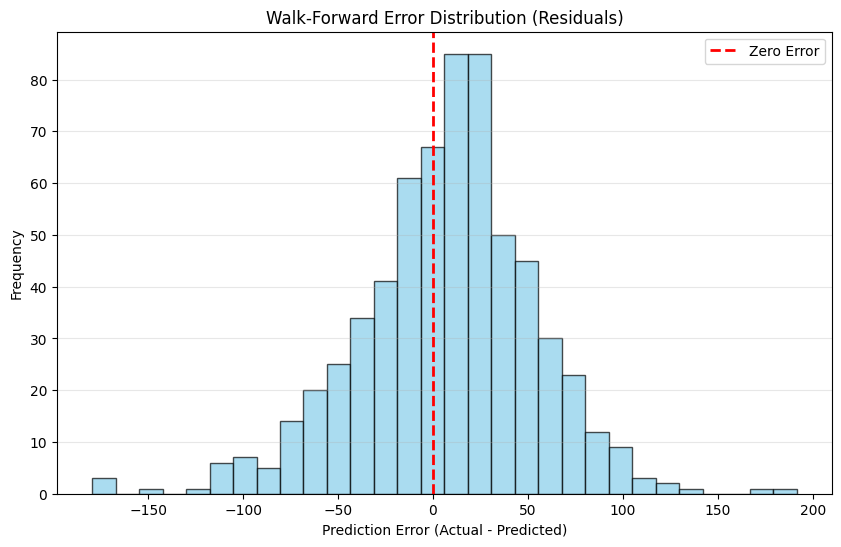
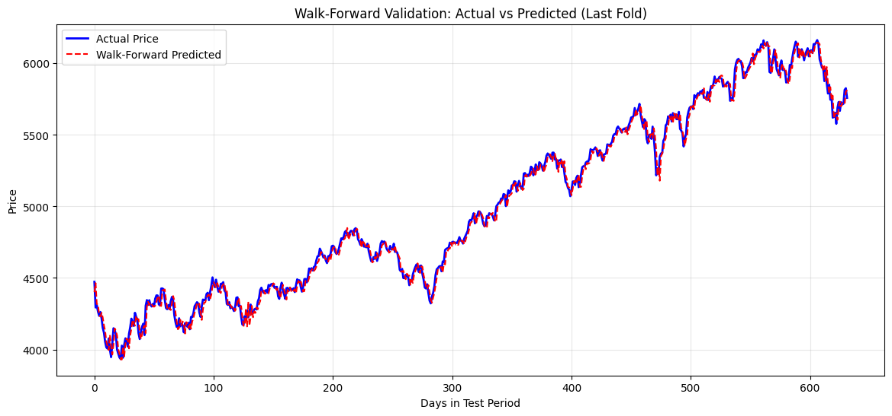

# Stock Price Prediction using Walk-Forward Validation & Feature Engineering
## 🎥 Project Overview Video (5 Minutes)

👉 **Watch the full project walkthrough here:**  
https://youtu.be/G9RdTj06Xnk

This video explains:
- Problem statement and motivation  
- Feature engineering strategy  
- Walk-forward validation methodology  
- Key results and insights  

This project focuses on **next-day stock price prediction** using historical price data combined with an external signal (`Data`). The primary goal is not just prediction accuracy, but **realistic evaluation** of machine learning models on **non-stationary financial time series**.

While several models were initially tested using a static train–test split, the final and most reliable approach adopts **Walk-Forward Validation (Expanding Window)** to eliminate data leakage and better simulate real-world deployment.

---

## 🏆 Final Methodology: Walk-Forward Validation

The final model used is **Ridge Regression**, evaluated via **Walk-Forward Validation**.

### Why Walk-Forward Validation?

- **Prevents Data Leakage**  
  Feature scaling is performed *inside each fold*, ensuring no future information leaks into the past.

- **Handles Non-Stationarity**  
  Financial markets evolve over time. Walk-forward validation retrains the model as new data becomes available, mirroring real trading conditions.

- **Production-Realistic Evaluation**  
  Unlike random or static splits, this method provides a trustworthy estimate of live performance.

---

## 📈 Walk-Forward Performance Metrics

### RMSE by Fold

| Fold | Training Date Range | RMSE |
|------|--------------------|------|
| Fold 1 | 2010-02-01 to 2012-08-07 | 15.65 |
| Fold 2 | 2010-02-01 to 2015-02-18 | 16.73 |
| Fold 3 | 2010-02-01 to 2017-08-24 | 29.27 |
| Fold 4 | 2010-02-01 to 2020-03-06 | 53.88 |
| Fold 5 | 2010-02-01 to 2022-09-12 | 46.63 |
| **Average** | **Final Walk-Forward RMSE** | **32.43** |

### Error Analysis (Final Fold)

- **Mean Error (Bias):** 8.21  
- **Standard Deviation of Error:** 45.90  

**Interpretation:**
- Low bias indicates minimal systematic over- or under-prediction.
- Error dispersion increases in later folds due to higher market volatility.
- Performance degradation over time reflects realistic market regime changes rather than model failure.

---

## 🛠 Feature Engineering

More than **20 engineered features** were created to capture trend, momentum, volatility, temporal structure, and cross-signal interactions.

### Price-Based Features
- Moving Averages: 5, 10, 20 days
- Momentum: 3-day and 5-day price changes
- Lagged Prices: 1–3 previous days

### Volatility Features
- Rolling standard deviation (5-day, 10-day)

### External Signal Features
- Lagged external data (1–3 days)
- Change in external signal

### Interaction Features
- Price / Data ratio
- Price × Data change interaction

### Calendar Features
- Day of Week
- Month
- Quarter

---

## 📊 Initial Model Comparison (Static Split)

| Model | RMSE | R² Score | MAE |
|------|------|----------|-----|
| Linear Regression | ~50 | ~0.99 | ~38 |
| Ridge Regression | ~50 | ~0.99 | ~38 |
| Lasso Regression | ~51 | ~0.99 | ~39 |
| ElasticNet | ~170 | ~0.92 | ~154 |
| Random Forest | ~874 | Negative | ~716 |

---

## 🚀 How to Run the Project

### 1. Install Dependencies
```bash
pip install pandas numpy matplotlib scikit-learn
```

### 2. Data Files
Ensure the following files are present:
- `StockPrice.csv`
- `Data 2.csv`

### 3. Execute the Notebook
Run:
```
FutureFirst_Assignment.ipynb
```

---
## 📉 Visualizations

### 1. Walk-Forward Error Distribution (Residuals)

This histogram shows the distribution of prediction errors (Actual − Predicted).  
The red dashed line indicates zero error, demonstrating low bias in the model.



---

### 2. Actual vs Predicted Price (Walk-Forward – Last Fold)

This plot compares the actual stock price with walk-forward predictions on the final test window.



---
## 🧠 Conclusion

Static evaluation methods are inadequate for financial forecasting due to **temporal dependency and regime shifts**. By adopting **Walk-Forward Validation**, this project achieves a realistic **average RMSE of 32.43**, demonstrating a production-ready approach to time-series machine learning.

---

## 📄 Author

**Jasteg Singh**  
Machine Learning | Time-Series Modeling | Applied AI
